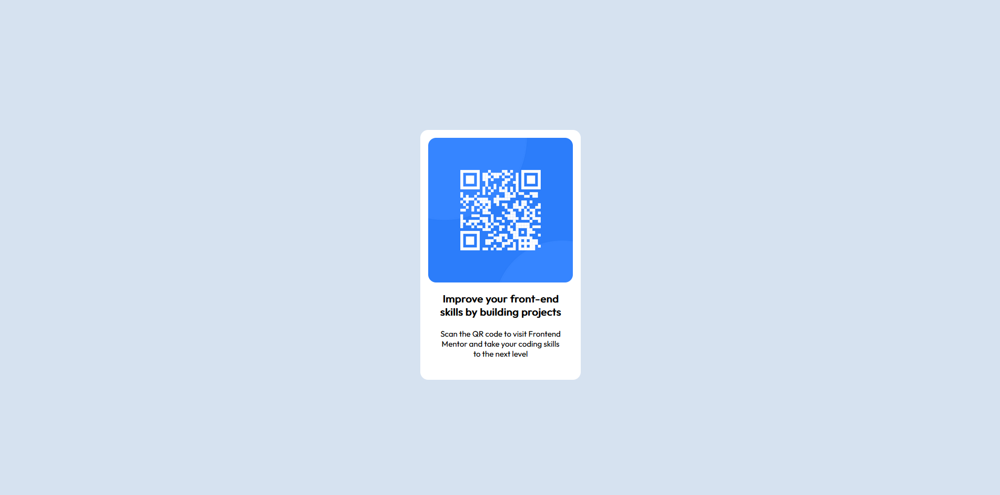

# Frontend Mentor - QR code component solution

This is a solution to the [QR code component challenge on Frontend Mentor](https://www.frontendmentor.io/challenges/qr-code-component-iux_sIO_H). Frontend Mentor challenges help you improve your coding skills by building realistic projects. 

## Table of contents

- [Overview](#overview)
  - [Screenshot](#screenshot)
  - [Links](#links)
- [My process](#my-process)
  - [Built with](#built-with)
  - [What I learned](#what-i-learned)
- [Author](#author)

## Overview

### Screenshot

### Links

- Solution: [Frontend Mentor Solution](https://www.frontendmentor.io/solutions/qr-code-component-with-html-and-css-6dAJ5shMlD)
- Live Site: [Github Pages](https://patricklee22.github.io/qr-code-component-main/)

## My process

### Built with

- Semantic HTML5 markup
- CSS custom properties
- CSS Grid
- Live Server - VS Code extension

### What I learned

- Using CSS Grid to center an element 
- Using Semantic HTML5 markup for accessibility 
- Importing a Font from Google into your CSS

## Author

- Frontend Mentor - [@yourusername](https://www.frontendmentor.io/profile/patricklee22)
- Github - [PatrickLee22](https://github.com/PatrickLee22)